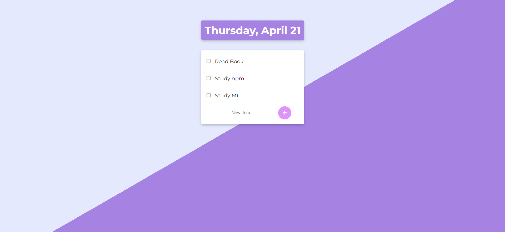

#_Website Link_
#_https://mysterious-basin-69921.herokuapp.com/_

#_The Main Screen of To Do App_


To Do app is a web application that you can add your todos with easy UI.
#Tech
To Do app uses a number of open source projects to work properly.

- [node.js] - for the backend 
- [Express] - node.js network framework
- [EJS] - node.js template framework
- [Google Fonts] - Beautiful Fonts

#Installation
To run the web app on your local computer you need Node.js to run.
```
cd todolist-v1
npm i
node app.js
```


[node.js]: <http://nodejs.org>
[Express]: <https://expressjs.com>
[EJS]: <https://ejs.co>
[Google Fonts]: <https://fonts.google.com>
